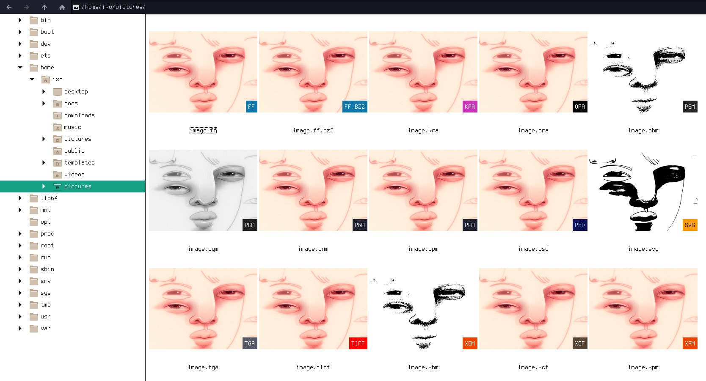

## iXo thumbnailer
  
Scripts bundle I use to generate my thumbnails: it may not suit you, but it may inspire you instead.  
When you work with many identical images but in different formats, you need to quickly identify them visually, so, after generating the thumbnail, a color label with the extension name is added to it.  
Following image extensions set:

| ext | mime | desc |
| --- | ---- | ---- |
| AI  | application/illustrator | Adobe Illustrator file |
| CBR | application/vnd.comicbook*-rar | Comic book rar archive |
| CBZ | application/vnd.comicbook+zip | Comic book zip archive |
| CR2 | image/x-canon-cr2 | Canon raw image |
| FF  | image/farbfeld | Farbfeld image |
| FF.BZ2 | image/farbfeld-bz2 | Compressed farbfeld image |
| JPG | image/jpeg | JPEG image |
| KRA | application/x-krita | Krita image document |
| ORA | image/openraster | OpenRaster image |
| PAM | image/x-portable-arbitrarymap | Portable arbitrary map image |
| PBM | image/x-portable-bitmap | Portable bitmap image |
| PGM | image/x-portable-graymap | Portable gray map image |
| PNM | image/x-portable-anymap | Portable any map image |
| PPM | image/x-portable-pixmap | Portable pixmap image |
| PDF | application/pdf | Portable document format |
| PNG | image/png | Portable network graphic |
| PSD | image/vnd.adobe.photoshop | Adobe photoshop document |
| SIXEL | image/sixel | Sixel bitmap |
| SVG | image/svg+xml | Scalable vectors graphic |
| TGA | image/x-tga | Targa graphic |
| TIF | image/tiff | Tagged image file |
| XCF | image/x-xcf | GIMP image |
| XBM | image/x-xbitmap | X11 bitmap graphic |
| XPM | image/x-xpixmap | X11 pixmap graphic |

List can be extended.

**Usage:** `ixo-thumbnailer [input] [output] [size]`

### Dependencies:
- imagemagick
- ghostscript (for AI)
- unrar (for CBR)
- unzip (for KRA and CBZ)

Add the following lines to `/etc/ImageMagick/delegates.xml` inside `<delegatemap>` tag:
```xml
<delegate decode="ai" encode="ps" command="&quot;gs&quot; -dQUIET -dSAFER -dNOPAUSE -dBATCH -sDEVICE=pngalpha -sOutputFile=&quot;%o&quot; &quot;%i&quot;"/>
<delegate decode="cbr" command="&quot;ixo-extract&quot; &quot;%i&quot; &quot;%o&quot;"/>
<delegate decode="cbz" command="&quot;ixo-extract&quot; &quot;%i&quot; &quot;%o&quot;"/>
<delegate decode="kra" command="&quot;ixo-extract&quot; &quot;%i&quot; &quot;%o&quot;"/>
```
this enables ImageMagick to work with such formats.
You may need to alter other files for the thumbnailer to work.

### Files:
- /bin/ixo-thumbnailer
- /bin/ixo-****-extract
- /usr/share/thumbnailers/ixo-thumbnailer.thumbnailer
